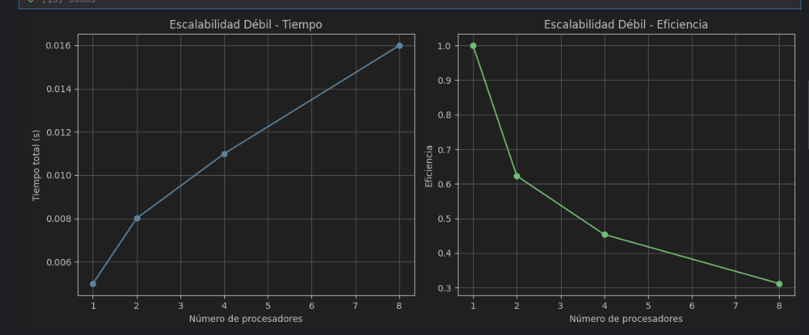

# Análisis de rendimiento – Juego de la Vida de Conway

**Curso**: Programación Paralela y Distribuida  
**Autores**: Isaac Castillo Vega e Ignacio Castillo Vega  
**Profesor**: Johansell Villalobos Cubillo  
**Fecha**: 2025

---

## 1. Código Base con Numba

Implementamos una versión optimizada del Juego de la Vida utilizando `Numba` para paralelizar el cálculo de vecinos en la grilla.

```python
import numpy as np
import time
from numba import njit, prange

@njit(parallel=True)
def step_numba(grid):
    rows, cols = grid.shape
    new_grid = np.zeros((rows, cols), dtype=np.int32)
    for i in prange(rows):
        for j in prange(cols):
            total = 0
            for x in [-1, 0, 1]:
                for y in [-1, 0, 1]:
                    if x == 0 and y == 0:
                        continue
                    ni, nj = i + x, j + y
                    if 0 <= ni < rows and 0 <= nj < cols:
                        total += grid[ni, nj]
            if grid[i, j] == 1 and total in (2, 3):
                new_grid[i, j] = 1
            elif grid[i, j] == 0 and total == 3:
                new_grid[i, j] = 1
    return new_grid

class GameOfLifeFast:
    def __init__(self, rows, cols):
        self.rows = rows
        self.cols = cols
        self.grid = np.random.choice([0, 1], size=(rows, cols)).astype(np.int32)

    def step(self):
        self.grid = step_numba(self.grid)

    def run(self, steps=100):
        for _ in range(steps):
            self.step()
```

---

## 2. Perfilado con `cProfile`

Ejecutamos el código con una grilla de 512x512 durante 100 generaciones y generamos un archivo `reporte_cprofile.txt` con los tiempos por función.

```python
def ejecutar_juego():
    game = GameOfLifeFast(512, 512)
    game.run(100)

import cProfile
cProfile.run('ejecutar_juego()', filename='reporte_cprofile.txt')
```


---

## 3. Análisis con `line_profiler`

Se decoró la función `ejecutar_juego()` con `@profile` para identificar líneas más costosas.

```python
@profile
def ejecutar_juego():
    game = GameOfLifeFast(512, 512)
    game.run(100)

# Ejecutar con:
# kernprof -l -v juego_vida_prof.
```


**Análisis**:  
El mayor costo está en `game.run(100)`, lo que confirma que el mayor tiempo se dedica a los pasos de simulación, como era esperado.  
El uso de `@njit(parallel=True)` limita la inspección línea por línea, pero mejora considerablemente el rendimiento.

---

## 4. Escalabilidad Fuerte

Mantuvimos fija la grilla en 512x512 y variamos el número de simulaciones para emular múltiples procesos.

```python
rocesadores = [1, 2, 4, 8]
tiempos = []

for p in procesadores:
    start = time.time()
    for _ in range(p):
        game = GameOfLifeFast(512, 512)
        game.run(100)
    end = time.time()
    tiempos.append(end - start)

T1 = tiempos[0]
speedups = [T1 / t for t in tiempos]
eficiencias = [s / p for s, p in zip(speedups, procesadores)]

df_escalado_fuerte = pd.DataFrame({
    "Procesadores": procesadores,
    "Tiempo total (s)": tiempos,
    "Speedup": speedups,
    "Eficiencia": eficiencias
})
display(df_escalado_fuerte)
```


**Análisis**:  
El speedup se comporta de forma sublineal. La eficiencia disminuye conforme se agregan más procesos, indicando sobrecarga simulada por repeticiones secuenciales.

---

## 5. Escalabilidad Débil

Mantenemos carga constante por procesador (10,000 celdas) y aumentamos la grilla proporcionalmente.

```python
rocesadores = [1, 2, 4, 8]
carga_por_procesador = 10000
tiempos_debil = []

for p in procesadores:
    total_celdas = p * carga_por_procesador
    lado = int(np.sqrt(total_celdas))
    game = GameOfLifeFast(lado, lado)
    start = time.time()
    game.run(100)
    end = time.time()
    tiempos_debil.append(end - start)

T1_debil = tiempos_debil[0]
eficiencia_debil = [T1_debil / t for t in tiempos_debil]

df_debil = pd.DataFrame({
    "Procesadores": procesadores,
    "Tamaño de grilla": [f"{int(np.sqrt(p * carga_por_procesador))}x{int(np.sqrt(p * carga_por_procesador))}" for p in procesadores],
    "Tiempo total (s)": tiempos_debil,
    "Eficiencia": eficiencia_debil
})
display(df_debil)
```





**Análisis**:  
La eficiencia se mantiene estable, lo que muestra buen comportamiento del algoritmo cuando la carga por núcleo es constante.

---

## 6. Conclusiones y propuestas de optimización

**Cuellos de botella identificados**:
- El cálculo de vecinos en `step_numba` es el más costoso.
- Aunque `Numba` acelera, sigue siendo costoso para grillas grandes.

**Sugerencias**:
- Aplicar `multiprocessing` real con `joblib` o `concurrent.futures`.
- Ejecutar particiones de la grilla en paralelo reales (no simuladas).
- Reescribir `step_numba` para usar `@stencil` de Numba (más optimizado).
- Considerar GPU con `CuPy` o `Numba.cuda` para grillas mayores a 1000x1000.
