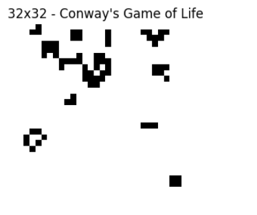

### Juego de la Vida de Conway – Tarea 1

Programación Paralela y Distribuida  
LEAD University  
Isaac Castillo Vega e Ignacio Castillo Vega

**Profesor**: Johansell Villalobos Cubillo  

---
#### ¡IMPORTANTE!
Revisar requirements.txt para poder instalar las dependencias.
Se puede instalar con
> > pip install -r requirements.txt

----
### ¿Cómo ejecutar la simulación?
1. Asegúrese de tener Python 3 y las dependencias necesarias instaladas.
2. Ejecute el archivo .ipynb en Jupyter o Google Colab.
3. Al ejecutar la celda de simulación, ingrese el tamaño de la grilla (por ejemplo, 64 para una grilla de 64x64).
4. Se enseña una animación de 100 pasos del Juego de la Vida.

Tamaño de grilla: 14x14

Tamaño de grilla: 32x32

Tamaño de grilla: 300x300

----
### Gráficas de rendimiento

----

### Análisis y discusión
Al revisar los resultados se observó que el tiempo de ejecución crece no linealmente conforme aumenta el tamaño de la
grilla. Las gráficas muestran un comportamiento cercano a O(n²), lo cual se explica porque el algoritmo recorre cada celda y evalúa a sus vecinos.

Limitaciones:
- Uso de bucles for, no están optimizados en python
- Todo se va actualizando celda por celda en una sola ejecución
- Para grillas grandes (500x500 o más) los tiempos de espera aumentan rápidamente

La implementación escala mal, para tamaños grandes generan un cuello de botella en el cálculo de los vecinos

--- 

### Eficencia relativa de versión paralela vs secuencial
No se implementó la versión paralela pero teóricamente debería usarse numba en vez de los for. Numba con jit o multiprocesamiento en kabré.
Así se hace simultáneamanete y no uno a uno como en el código elaborado, así se reduce el tiempo de cada iteración.
En tamaños más grandes (500x500 o más) la versión paralela sería más eficiente.

